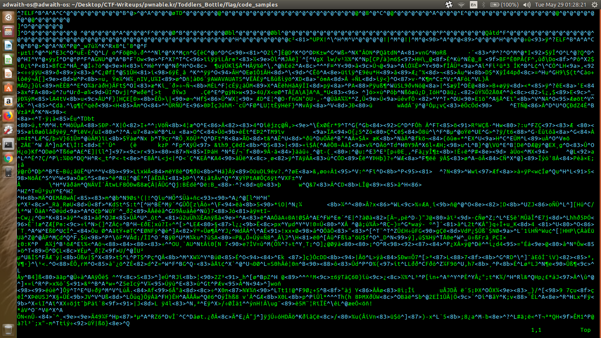
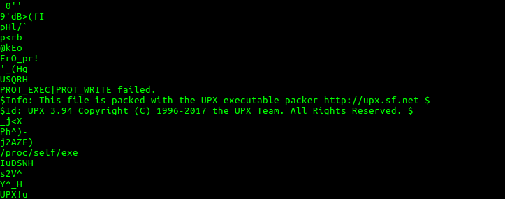
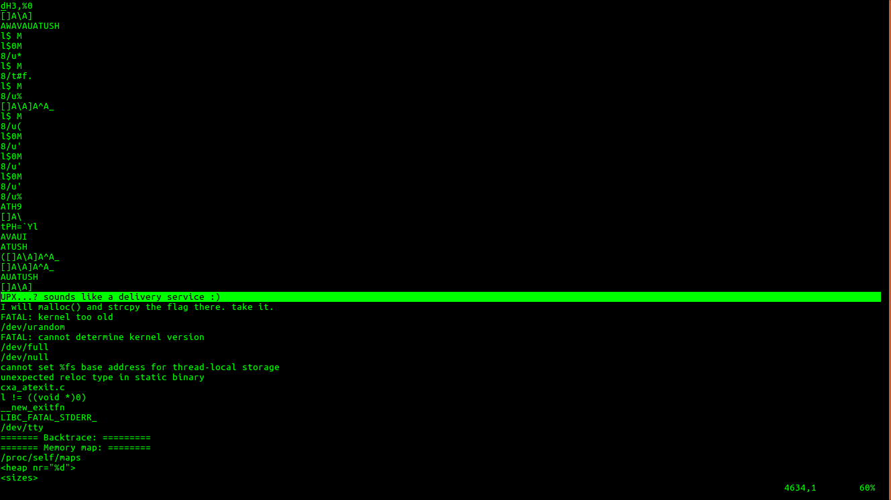

## To pwn: flag

#### Question: 

>Papa brought me a packed present! let's open it.

>Download : http://pwnable.kr/bin/flag

>This is reversing task. all you need is binary

### How did I pwn it?
[Link to **flag** binary](./code_samples/flag)

1. For this question, there is no source code given. We have to completely rely upon the binary for all details.

2. The first thing to do when you have a new **binary** is , to use the **file** command and see it's details. 

	* Ideally, file command should show the **BuildID** , but this is not showing. Something fishy.

3. Just open the binary in a text editor. 

	 * Just an observation. A binary will contain a lot of **^@** / **NULL** characters. But this hardly contains any as seen from an editor. 

4. I tried to get the Disassembly of the binary. Used **objdump** to get it. It **couldn't disassemble it**. 

	
	* It could read and process the  header properly, but it was not able to process the **machine code** part. This is very fishy. 
	
5. I used **strings** command to check the strings present in the binary. This revealed the true color of this binary.
[Link to file with strings in the binary](./code_samples/flag.strings)

* The statement itself says, **This file is packed with the UPX executable packer http://upx.sf.net**. 

7. Run the **flag** executable. It will give this output = **I will malloc() and strcpy the flag there. take it.**. 
	
8. **Unpack** the binary using **upx**.
[Link to the **upx** tool](./code_samples/upx)
	* Download the **upx** tool from [http://upx.sf.net](http://upx.sf.net).
	* First, move the upx tool into **/usr/bin**. 
	* `$ upx -d flag`	: This will unpacks the binary.(It doesn't create a new file).

9.  
* Use the **file** command to inspect the unpacked **flag** binary.

	* I hope you get the difference.

* Also check out the binary using a text editor. It has a lot of **^@** / **NULL** characters.

* Using **strings** command, I have generated [this](./code_samples/flag.unpacked.strings) strings file of unpacked executable.  You can just see the difference. These strings make so much meaning . 

8. The main job, pwning it! (From here, **flag** refers to the unpacked version)

	* Run the executable. We get the same output = **I will malloc() and strcpy the flag there. take it.**
	* Then, we will do as it says. Let us checkout for a **malloc()**, and **strcpy**, while running it using **gdb-peda**.
	
* Running using gdb: 

		adwaith-os@adwaith-os:~/Desktop/CTF-Writeups/pwnable.kr/Toddlers_Bottle/flag/code_samples$ gdb -q flag
		Reading symbols from flag...(no debugging symbols found)...done.
		gdb-peda$ disass main
		Dump of assembler code for function main:
		0x0000000000401164 <+0>:	push   rbp
		0x0000000000401165 <+1>:	mov    rbp,rsp
	    0x0000000000401168 <+4>:	sub    rsp,0x10
	    0x000000000040116c <+8>:	mov    edi,0x496658
	    0x0000000000401171 <+13>:	call   0x402080 <puts>
	    0x0000000000401176 <+18>:	mov    edi,0x64
	    0x000000000040117b <+23>:	call   0x4099d0 <malloc>
	    0x0000000000401180 <+28>:	mov    QWORD PTR [rbp-0x8],rax
	    0x0000000000401184 <+32>:	mov    rdx,QWORD PTR [rip+0x2c0ee5] # 0x6c2070 <flag>
	    0x000000000040118b <+39>:	mov    rax,QWORD PTR [rbp-0x8]
	    0x000000000040118f <+43>:	mov    rsi,rdx
	    0x0000000000401192 <+46>:	mov    rdi,rax
	    0x0000000000401195 <+49>:	call   0x400320
	    0x000000000040119a <+54>:	mov    eax,0x0
	    0x000000000040119f <+59>:	leave  
	    0x00000000004011a0 <+60>:	ret    
		End of assembler dump.
		gdb-peda$ 

	* The above code has a **malloc**. Look at the second **call**- call 0x400320. That could be the strcpy .
	
	* `gdb-peda$ break main`	: Break at main function.
	* Then go 1 instruction at a time using the **ni** command.
	* After **<+32>** is executed, **rdx** points to the flag we want. Have a look at this screenshot below.
	
	* The above screenshot is the peda-output. If you are not using **peda**, start using it. It is a python script which helps a lot while reversing. 
	* The string can be found out even without peda like this.
			
			(gdb) x/s $rdx
	
	
	* We have got the flag now. It can be verified that **0x400320** has the **strcpy@plt** / PLT Entry of strcpy function. 

### FLAG: UPX...? sounds like a delivery service :)
-----------
I was almost done with the writeup, when I got a quick hacky idea to find the flag .

1. The output of the executable told, **I will malloc() and strcpy the flag there. take it.** 
	
	* This simply means, the flag we want is also a string in the executable. By this method, we have to get the flag if we search through [this](./code_samples/flag.unpacked.strings) file. 
	
	* I was more motivated to find the flag using this method because, any constant strings stored by programmers in the executables, they will be stored very close to the **top** of the executable(They will be stored in .rodata segment, which is placed close to top of executable) and I wont have to run it using gdb :P . So, high chances that I would find the **flag** at the very beginning of my search in that file.
	
	* Take a look at this image.

	* As guessed,  it was the **first** string in the set of **meaningful strings**. 
	
**NOTE**: These types of methods do not work in every question. 

--------------
**PS**: 

1.  If sourcecode is given, the approach is different. But when only binary is given(like this question), it is always better to perform **basic static analysis** on the binary first, before running it using debugger. Because, we can get a lot of lead due to static analysis. This is a rough order I follow to do statis analysis.

	* **file** command: Gives general details of the executable. 
	* Having a look at the executable in a text editor. This is simply an observation.
	* The **objdump** fail told something about the executable.
	* Knowing the **strings** in a binary, tells a lot about that binary. In this question, Because of this, we solved the whole case.(We got to know it was packed).

### A few important concepts explored in this question.

1. **Packing**: This is a method used generally by malware authors to hide the sourcecode(see, objdump failed. That is what the bad guys want!). 

*	Generally, any packing tool while packing will embed **run-time** unpacking code, which is run first, to unpack the executable at runtime and then normal executable takes place once unpacking is done.

* Packing is one of the many code-hiding methods. Code-hiding is generally known as **Obfuscation**. 

* **UPX** is a very popular packing / unpacking tool, which is in use since the late 1990s. It has been used by malware authors to thwart(make it hard) the analysis.

* Compare the strings of the packed and unpacked binaries. There are hell lot of differences. The packed hardly has meaning strings. The unpacked has hell lot of meaningful strings. This difference can be used to conclude if binary is Packed / Obfuscated. Because, when it says statically linked, there should be names of so many functions, but the packed one hardly had any.

2. That observation of presence of **^@** / **NULL**  characters can be formalized to get some lead about the binary. 

* There is a concept known as **Entropy of a executable**. It is a scale from **0 - 8**, which can be calculated for a binary.
	
	* If a file contains only **0**s, then the entropy if that file = 0. That is because, there is high order / zero randomness in that file.
	
	* Consider a general binary. It contains a lot of characters in a random manner. So, entropy is > 0.
	
	* Consider an unpacked and packed versions of the executable. You can safely conclude that **entropy of packed version** > **entropy of unpacked version**. That is exactly because, it has many NULL characters and has less randomness than the binary of packed version.
	
	* Entropy study is very important when it comes to malware analysis. Mostly, malware will be Obfuscated / Packed / Compressed / Encrypted with run-time code to bring the executable back. This being the case, Entropy study of malware tells the nature of the malware - whether it is packed / unpacked.  

3. Regarding the failure of **objdump** : 

	* **objdump** is a very handly tool to disassembly binaries. But it is not a **powerful** one. It might **fail** when the binaries are too huge to process. 
	
	* In such cases, use powerful disassemblers like **ida**, **radare2**. My personal favorite is radare2. It is not only a powerful disassembler, but also has a decompiler, supports many formats and more.

